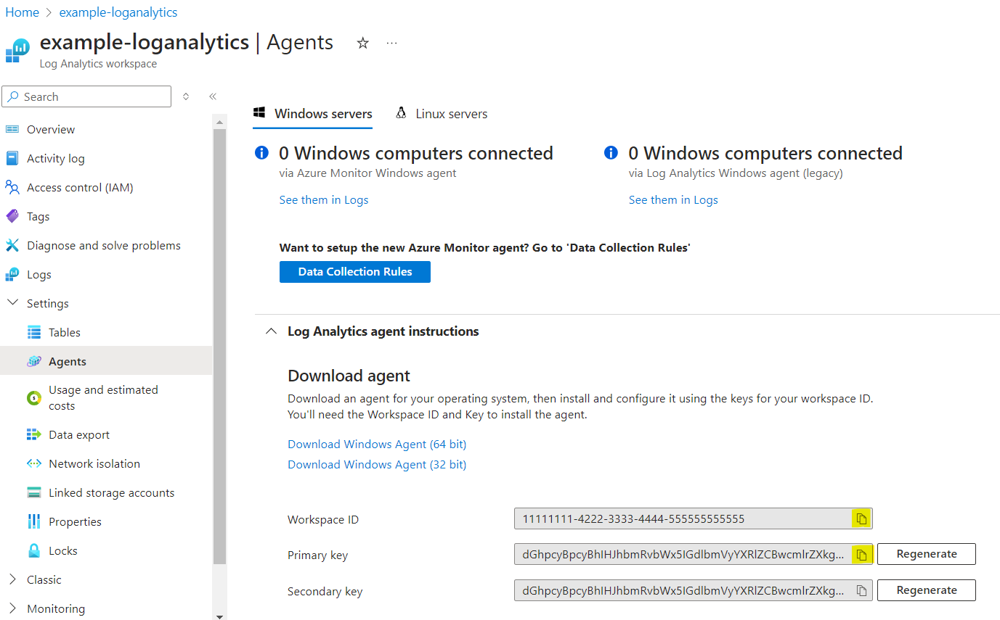
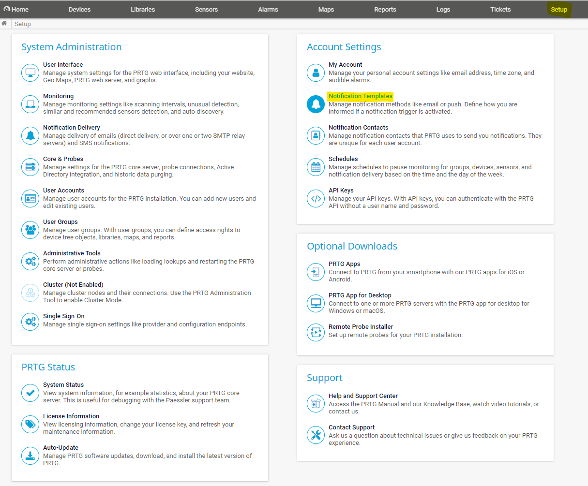
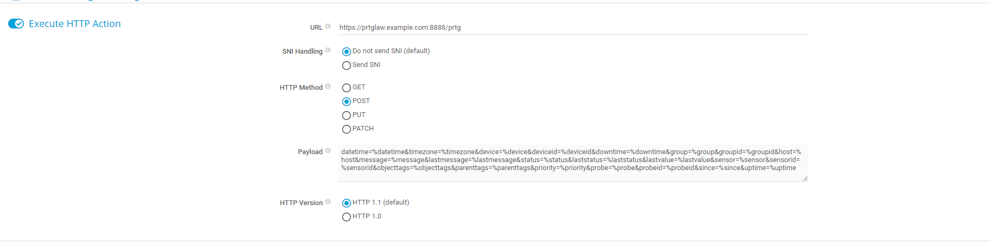

# PRTG-LAW

A simple utility to forward PRTG Webhook data to Azure Log Analytics Workspace 

### Environment Variables

| Variable      | Purpose                                               | Default   |
| ------------- | ----------------------------------------------------- | --------- |
| WORKSPACE_ID  | The Log Analytics Workspace identifier                | *required |
| PRIMARY_KEY   | The Log Analytics Workspace primary key               | *required |
| TABLE_NAME    | The target Log Analytics Workspace table to populate  | "PRTG"    |
| LISTEN_HOST   | The IP Address on which to listen                     | "0.0.0.0" |
| LISTEN_PORT   | The Port on which to listen                           | 8888      |
| HTTP_ENDPOINT | The Webhook handler endpoint path                     | "/prtg"   |

### Azure Setup

1) Navigate to the [Azure Portal](https://portal.azure.com) and log in.
2) Create a new or navigate to an existing Log Analytics Workspace
3) Navigate to **Settings > Agents** and expand **Log Analytics agent instructions**
4) Copy the **Workspace ID** and the **Primary key** for use in PRTG-LAW
5) Populate the `.env` file or Docker environment variables with the acquired values 

### PRTG Setup

1) Log in to your PRTG Core instance
2) Navigate to **Setup > Notification Templates**

3) Create a new **Notification Template** and enable **Execute HTTP Action**
4) Enter the Webhook URL based on the host, port, and endpoint. E.G.  `https://prtglaw.example.com:8888/prtg`
5) Set the HTTP Method to **POST** and enter the following payload:

    `datetime=%datetime&timezone=%timezone&device=%device&deviceid=%deviceid&downtime=%downtime&group=%group&groupid=%groupid&host=%host&message=%message&lastmessage=%lastmessage&status=%status&laststatus=%laststatus&lastvalue=%lastvalue&sensor=%sensor&sensorid=%sensorid&objecttags=%objecttags&parenttags=%parenttags&priority=%priority&probe=%probe&probeid=%probeid&since=%since&uptime=%uptime`

### Log Analytics Workspace Function

Create a function called `PRTG` which pulls from the `PRTG_CL` LAW table (Note: Azure will add the `_CL` suffix, so this example uses the environment variable `TABLE_NAME=PRTG`)

    PRTGT_CL
    | project
        TimeGenerated,
        DateTime=prtg_datetime_t,
        Date=prtg_date_s,
        Time=prtg_time_s,
        Since=prtg_since_t,
        TimeZone=prtg_timezone_s,
        ProbeName=prtg_probe_s, ProbeID=prtg_probeid_d,
        GroupName=prtg_group_s, GroupID=prtg_groupid_d,
        DeviceName=prtg_device_s, DeviceID=prtg_deviceid_d,
        SensorName=prtg_sensor_s, SensorID=prtg_sensorid_d,
        Settings=prtg_settings_s,
        Priority=prtg_priority_s,
        Host=prtg_host_s,
        Message=prtg_message_s, LastMessage=prtg_lastmessage_s,
        Status=prtg_status_s, LastStatus=prtg_laststatus_s,
        LastValue=prtg_lastvalue_s,
        UptimePercent=prtg_uptime_d, DowntimePercent=prtg_downtime_d,
        ObjectTags=prtg_objecttags_s, ParentTags=prtg_parenttags_s

Made with ❤ by [Austin Archer](https://linktr.ee/austin.archer)